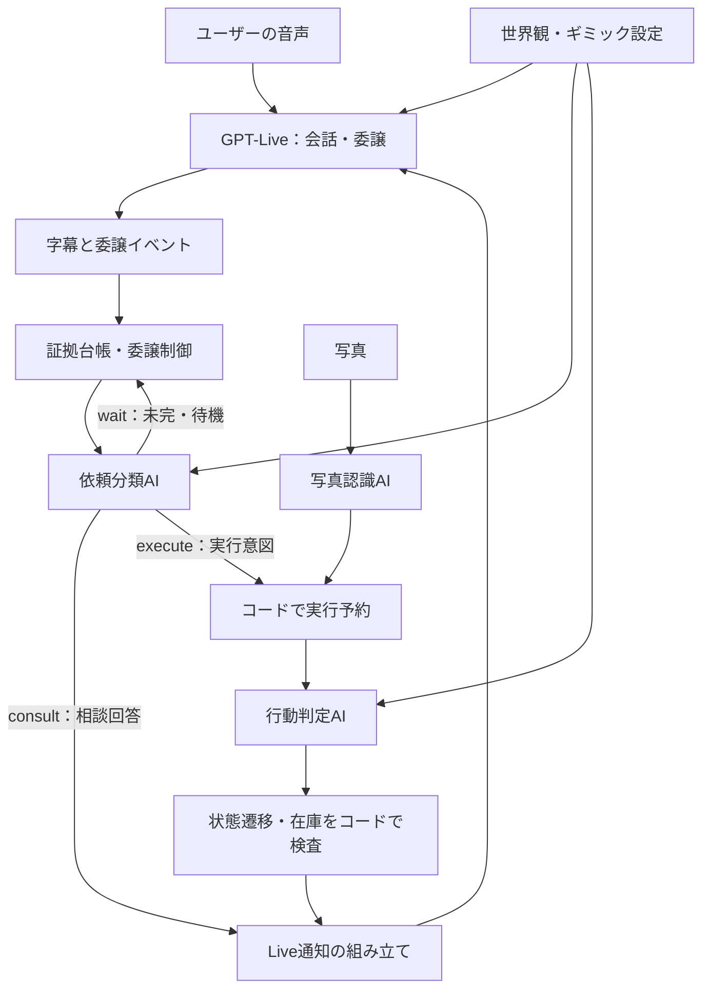

# Web版 AI指示マップ

調査日: 2026-09-15 / 基準: develop b158d55。指示・処理の実装を静的に調査したもの。実際の発言の発生源をログで特定した結果ではない。今回、ゲームの挙動やプロンプト自体は変更していない。

更新: 2026-09-15 [Liveによる発話生成](../specs/live-authored-dialogue/spec.md)を実装。以下の旧調査のうち、完成した回答文をそのままLiveへ渡す記述は現在の構成と異なる。最新の差分は次節を参照。

## 現在の発話経路

- 声と最終的な言葉選びはGPT-Live。裏側はゲームの判定・公開情報の選択を担当する。
- `core-intent-ai.ts` の `consult.answer` は完成台詞ではなく、関連する公開事実・不確実性・必要な確認の資料。`reason` は内部用でLiveに渡さない。
- 雑談は `responseKind: social`、`answer: ""`。サーバーの受付・20クレジット精算は維持し、Liveには受付情報だけを返して、自分で返答を考えさせる。秘密開示の選択や台詞生成の追加呼出しは行わない。
- 行動確定後は `companion-response.ts / companionResultFacts` が公開結果・現況・道具状態を同期的に投影する。以前の `companion_reply` Responses呼出しは本編から除去した。秘密を知る判定AIの文章は既存の公開投影を通す。
- `live.ts / speechCommands` は通知ID付きの一つの資料を送る。短い資料はcommentary一つ。長い資料はthinkingに分割し、全資料の後にcommentaryを一つ送る。各appendの480 UTF-8 bytes上限を維持し、未完資料からは発話を始めないよう指示する。
- 相談直前の同じ現況の追加送信、写真自動行動の受付台詞を除いた。同じ依頼の再送は既存の証拠消費・通知順序で防ぎ、同一通知のevent IDも安定させる。
- 通常の時間警告は従来どおり発話開始を要求しないthinking。最終警告は通知資料として一度伝える。クレジット案内は画面に残す。

実音声での自然さ・漢字の誤読・意味的な重複の改善は未検証。[検証実績と試遊手順](../specs/live-authored-dialogue/verification.md)。

## まず押さえる構成

「進行AI」は一枚のプロンプトではない。Liveが会話をし、別のResponses呼び出しが相談回答・依頼分類・行動結果を作る。最後にコードが状態変更を検査して確定する。Liveは届いた文章を自然に発話するため、上流の文章が事務的ならLiveの口調設定だけでは解消しない。

依頼分類と行動判定は別の呼び出しだが、通常は同じGAME_MODELを使う。既定値はgpt-5.6-sol、Liveはgpt-live-1（環境変数で変更可能）。実際の運用設定は今回読み取っていない。[モデル設定](../packages/server/ai-config.ts)、[呼び出しの接続](../apps/local-server/hosted-runtime.ts)。

## 1. どこを編集すると何が変わるか

| 層 | 主な場所・関数/項目 | 影響すること |
| --- | --- | --- |
| Liveの基本指示 | [live.ts](../apps/local-server/live.ts) / liveInstructions | 相棒の役割、挨拶と委譲の区別、結果の捏造防止、回数0時の扱い、内部指示を話さない方針 |
| 会話の追加設定 | [game-core.json](../config/game-core.json) / conversation.ja/en.liveInstructions | 口調、テンポ、相談の委譲、復唱しない、先回りヒントをしない |
| 世界観と物語演出 | [story-catalog.json](../scenarios/story-catalog.json) / story.aiName・world・phases | メイの人格、未来との通信、AIができること、序盤・中盤・終盤の雰囲気 |
| 舞台と最初の謎 | 同上 / scenes[].description・mystery・openingClue・sequences | 場所、拘束、足音、謎、採用する3ギミックの順番 |
| 導入文の組み立て | [story.ts](../apps/local-server/story.ts) / storyOpening | 現行カタログの自己紹介・現在状況・協力の依頼。文の骨格はコードにある |
| 最初の呼びかけ | live.ts / openingCommand | 「聞こえる？ 聞こえたら返事をして」という開始通知 |
| 依頼分類・相談回答 | [core-intent-ai.ts](../apps/local-server/core-intent-ai.ts) / classifyCoreIntent | wait / consult / executeの判断、参照道具、相談時に実際に話すanswer |
| 分類の調整例 | game-core.json / conversation.ja/en.classificationExamples | 質問・明示指示・言いかけの例示。Liveへではなく分類AIへ渡る |
| 写真の認識 | [game-ai.ts](../apps/local-server/game-ai.ts) / createGameAI().recognize | 道具名、写真と在庫の参照、用途の認識。成功は確定しない |
| 行動の可否・結果 | 同上 / createGameAI().judge | 現在の障害を突破するか、部分進展、結果文narrative・現況situation |
| 共通の判定方針 | game-core.json / judgment.physicality・ambiguity・partialProgress | 通常の物性、合理的解釈、部分進展。分類AIにも渡される |
| 個々の成功・拒否条件 | story-catalog.json / gimmicks[].mechanism・acceptance・rejection・examples・states | 「この物をこの使い方で使うと通るか」を最も直接左右する |
| シナリオの変換時に追加される方針 | [story-catalog.ts](../packages/shared/story-catalog.ts) / compileStoryScenario | カタログから実行用goal/constraintsを構成し、共通のjudgmentPolicyもコードで追加 |
| 確定後の通知 | [hosted-runtime.ts](../apps/local-server/hosted-runtime.ts) / sendFacts・speak・onDecision・実行処理 | 相談回答、行動結果＋現況、写真受信、エラーなどをLiveへ渡す |
| 時間警告 | game-core.json / warnings.milestones、hosted-runtime.ts / tick・drainNotifications、voice-notifications.ts、live.ts | 通常警告は静寂を待ってthinkingの補足情報へ。最終警告は有限待機後にcommentaryへ。日英の文面はmilestonesで設定 |
| ヒントの出し分け | story.ts / requestsStoryHint・storyHint、カタログgimmicks[].hints | ヒント要求の検出と段階選択。通常の相談には全解法を渡さない |

### 大事な編集上の注意

- Liveの最終instructionsは、live.ts内の固定文 → game-core.jsonの追加文 → 世界観・公開状態のJSON、という連結。独立した優先度付き設定ではなく、一つの指示文に混ざる。末尾へ「自然に」と追加しても、他の制約を必ず打ち消せるわけではない。
- 現行カタログにはstoryがあるため、導入はstoryOpeningが生成する。game-core.jsonのopeningMessageだけ変えても、この経路の導入は変わらない。これはstoryを持たないシナリオ用の代替文。
- Web版の既定はscenarios/story-catalog.json。SCENARIO_PATHを設定していれば別ファイルになる。[設定ロード](../apps/server/scenario-catalog.ts)で新規プレイに設定のスナップショットを作る。編集後は新しいプレイで確認する。デプロイ環境へは別途反映が必要。
- .agents/skills/call-to-past/assets/masters.jsonは参考・移植元であり、Web実行時に読まれる正本ではない。

## 2. メタ発言はどこから入り得るか

### 確認できた事実

1. Liveの初期状態にcreditsRemainingとremainingMsを渡している（live.ts）。分類AIにも公開状態として残りクレジットが渡る（hosted-runtime.ts / publicContext）。
2. 会話20・写真100/枚とサーバー確定の残高を渡す。100未満なら写真を要求せず手持ちで工夫する。0でも受理済み処理中は終了を宣言せず、確定通知に従う。警告は「ご利用可能クレジットが残りわずかです」、枯渇は「クレジットを使い切りました。」。
3. warnings.milestonesの通常警告は「おっと、残り時間が少なくなってきた。」。最終警告は「あっ、まずい！ もう時間がない！」等の切替表現。残されたtimeWarningは旧形式互換用で、v2の警告設定はwarningsが正本。
4. 分類AIのconsult.answerは、そのまま発話用通知へ回る。「短いユーザー向け回答」とは指示するが、世界内の言葉に置き換える表現規則は十分に定義されていない。
5. 行動判定AIには「脱出ゲームの裏方」「現在障害のgoal」「factChanges」など内部の概念を与え、同じ出力でユーザー向けnarrative/situationも書かせている。
6. hosted-runtime.tsの技術エラー文には「処理できませんでした。行動は消費していません。指示をもう一度話してください。」があり、Liveへ発話通知される。これはAIが考えた台詞ではなく固定文。
7. 現況通知には「現在の状況: 」という接頭辞がつく。これは誤情報ではないが、読み方によっては進行役・システムに聞こえやすい。

### 「あと2回」についての結論

確認した現行ソースには「残り2回を自発的に毎回伝えろ」という指示は見つからない。一方、AIは正確な回数を受け取り、回数を説明してよい文脈で動いている。従って、自発的な補足、相談回答からの流入、過去会話の言い回しが候補となる。発言の実例とその時点の通知がないため、どの経路かは断定できない。

「制限回数」が行動数を指していた場合はさらに意味の取り違え。現行の制限は新しい写真の送信回数であり、送信0回でも手持ち道具の行動は続けられる。コードにもプロンプトにもその区別がある。制限の数値を消すことと、発話で数値を自発的に説明しないことは別の変更。

### 修正を依頼する時の例（未実装の提案）

> 残り回数の判定とUI表示は維持する。Live、相談回答、結果文では数字や「制限回数」「行動消費」を自発的に読み上げない。聞かれた場合と送信0回の時だけ案内し、端末の制約として自然な言葉にする。残り1分の警告は残す。通信障害時は状況を偽らず、短い通信トラブルの表現にする。

この変更はLiveの口調だけでなく、core-intent-ai.tsのanswer、game-ai.tsのnarrative/situation、hosted-runtime.tsの固定通知、世界観設定を揃える必要がある。端末の電池・通信回数などの理由を付けるなら、先に設定として合意する。未確定の世界設定をAIに勝手に補わせない。

## 3. 「通るはずの依頼」が止まる場所

| 段階 | 主な条件・見落としやすい点 | 調べる場所 |
| --- | --- | --- |
| Liveが委譲しない | 挨拶とゲーム相談の誤分類、相づちだけで止まる | live.ts、委譲イベントの有無 |
| 依頼分類がwait | 未完の指示、裸の「はい」、実行根拠不足、長すぎる入力。waitは失敗判定ではない | core-intent-ai.ts、classificationExamples |
| 依頼分類がconsult | 「切れる？」は可能性の質問であり実行しない。相談回答AIには現在ギミックの完全なmechanism/acceptanceは渡らず、公開状態と要求されたヒント中心 | core-intent-ai.ts |
| 道具参照が作れない | 写真/在庫にない物は使えない。executeのitemRefsは最低1件必要で、素手だけの単独行動は現在の構造では表せない | packages/shared/conversation.ts / executeIntentSchema |
| コードが実行を予約しない | 未認識写真、使用済み道具、古い指示、再利用済みの発話証拠、判定中、接続世代や操作権の不一致 | game.ts / reserveAction、conversation.ts |
| 判定AIが不成立にする | 本人/メイの能力、現在障害の仕組み、acceptance・rejectionの解釈。現場にない機能や特殊能力は認めない | game-ai.ts、story-catalog.json |
| 成功回答なのに処理エラー | 未宣言の状態遷移、successとcompletionFactの不一致、存在しない在庫変更はコードで棄却 | game.ts / judgeAction |
| 状態は進むが返事が来ない | 結果がoutboxに入ったか、ブラウザが送れたか、音声が再生されたかは別段階 | hosted-runtime.ts、live-outbox.ts、apps/web/src/PlayScreen.tsx、apps/web/src/live.ts |

### 実際に効く制約の例

- story.worldには「メイは道具を保持・操作する」「道具なしで拘束や扉を動かしたり人を運んだりできない」「壁・扉・格子の向こうへ直接生成できない」等がある。自然な人間相手のつもりで「そっちに歩いて」「その扉を手で開けて」と頼んでも、設計上の役割と食い違う可能性がある。
- 通常の道具の工夫は認める指示がある。game-ai.tsには「他の説明可能な工夫も認める」、変換後judgmentPolicyにも「代用品や筋の通る組み合わせを認める」「非公開の寸法・重量閾値を加えない」とある。想定道具と違うだけで落ちるなら、意図ではなく判定のぶれや個別条件の問題として調べる。
- カタログのacceptanceとstates.clearedがgoalになり、rejectionとexamplesがconstraintsになる。examplesまでconstraintsの配列に入るため、例を必須条件のように読んでいないかは確認候補。ただし、それが実際の拒否原因だと確認したわけではない。
- 世界観への質問は公開設定で答えられる一方、未確認の真相は「分からない」と答える設計。機械の仕組みを含む通常相談は行動判定より情報が少なく、相談では慎重な答えでも実行判断では通る、という差が生じ得る。
- 委譲には20秒の期限、評価試行上限がある。委譲がない場合は発話が3秒安定してから回復の確認を行い、回復確認は10秒間隔。通常の実行で毎回3秒待つ仕様ではない。古い依頼を勝手に実行しないための制御。
- 状態は現在のギミックのblocked/partial/clearedを中心に管理する。自由な移動・任意の環境変更まで全部を記録する汎用世界シミュレーターではない。

## 4. やりたい調整と指示の出し方

| 調整したいこと | 修正依頼の例 | 主な対象 |
| --- | --- | --- |
| 回数の読み上げを抑える | 数字の管理は維持し、求められない限り声で説明しない。0回時だけ自然に案内 | live.ts、core-intent-ai.ts、game-ai.ts、hosted-runtime.ts |
| キャラクターとして話す | メイの人格・敬体/常体・緊迫度を統一。裏方の結果文も同じ口調にする | story.world、conversation.liveInstructions、answer/narrativeの生成指示 |
| 工夫をもっと通す | 特定の道具名ではなく必要な作用で判定。具体的な通してほしい例・落としてほしい例を指定 | gimmicks[].acceptance/rejection/mechanism、judgmentPolicy、judgment設定 |
| 「これでやって」を通す | 直前の相談を指す省略指示は、道具と用途が特定できれば実行として扱う | core-intent-ai.ts、分類例、会話履歴の渡し方 |
| 素手や移動も認める | メイと本人の操作分担を決め、道具のない行動も表せるようにする | 世界観、executeIntentSchema、予約処理、状態モデル。プロンプトだけでは不足 |
| ヒントを自然にする | 正解を即答せず観察→作用→具体例の順で会話にする | story.ts、gimmicks[].hints、consult.answer |
| 話しかけても止まるのを調べる | 委譲・分類・予約・判定・通知のどこで止まったか確認 | intent-coordinator.ts、game.ts、開発trace |

最も調査しやすい報告は「現在の障害／送った写真／直前の会話／今回の依頼／実際の返答／期待する結果」。同じ「通らない」でも、相談扱いと物理的不成立と技術エラーでは変更箇所が異なる。

## 5. 会話以外のAI指示

| 処理 | 指示の場所 | 本編会話への関わり |
| --- | --- | --- |
| 現況画像生成 | [image-service.ts](../packages/server/image-service.ts) / scenePrompt、シナリオcore.visualStyle・characterAppearance | 確定状態から画像を描く。Liveの人格を直接設定しない |
| 画像の大きな矛盾検査 | 同上 / inspectScene、game-core.json / visualInspection | 不適切な画像を表示しないための検査 |
| 結末の伏線抽出・短編・評価 | [ending-ai.ts](../apps/local-server/ending-ai.ts) / endingClues・narrativeRules・createEndingText | 終了後の物語と評価文 |
| エンディング映像の設計 | 同上 / createEndingDesign | 映像用プロンプト。公開済みの結末を変えない指示 |
| エンディング画像生成・検査 | [ending-image-service.ts](../packages/server/ending-image-service.ts) | 映像用画像の生成/検査 |
| 自動ミッション生成プロトタイプ | tools/auto-mission/prompts/*.md、config/auto-mission/default.json、provider.ts | CLI専用。本編のLiveにこの指示が流れる構成ではない |
| 実Liveの検証用 | apps/local-server/core-live-probe.ts と関連tools | 検証画面用。本編の指示と混同しない |

packages/server/openai.tsとai-service.tsは通信・許可・上限を担う。人格指示の主な編集場所ではないが、タイムアウトや出力上限で依頼が失敗する場合は関係する。

## 6. 次の整理の方針（提案、未実装）

1. 内部の正確な状態と、プレイヤーへ話す表現を分ける。数値を隠して誤判定を招くのではなく、発話方針を統一する。
2. Live・相談回答・行動結果の3か所で共有する「メイの話し方」を設ける。固定通知も同じルールに合わせる。
3. ゲームの公正さを守る制約と、雰囲気の演出指示を分ける。制約を緩める変更は、通してほしい具体例に基づいて行う。
4. 依頼が通らなかった事例は、まずどの段階で止まったか特定する。個別事例なしに全制約を緩めない。

今回は調査資料のみ作成。実API呼び出し・挙動変更・テスト追加はしていない。既存の未追跡企画資料は変更していない。
