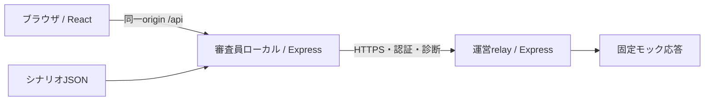

# 構成と責務

## 今回動くもの

開発時はViteが /api をlocalへ転送。ビルド後はlocalが画面とAPIを同じ4310番で提供。画面に返すのはシナリオの公開概要だけ。
localはJSONの読込/検証と診断要求を担当。relayに認証してトークンを取得し、その要求内で診断に使用する。tokenをブラウザへ返さず永続保存もしない。
relayはモック診断のみで、AIを呼んだふりはしない。API通信時間とゲームの時間を混同しない。

## ゲーム本編で追加する境界

localに進行、時計、所持品、prompt、AI出力の検証を置く。relayはそれらをimportしない。
GPT-LiveはブラウザのWebRTC音声と、localが持つゲーム判断をつなぐ。起動時のSDP交換をrelayが認証して中継する設計を後続で実装/検証する。
画像/動画などのAPI操作も許可リストで限定し、relayがキーを付けて中継。通常のAPIキーをlocalやブラウザへ取得させない。Realtime短期キーを全APIの認証と見なさない。
外部中継のコードも提出し、外部依存を説明する。審査規定への適合は未確認。

## 認証と通信の制約

- 運営設定requiredが既定。秘密が空/認証modeが不正なら起動失敗。noneは合言葉だけ省略。
- ローカル専用dev:allはknownなテスト合言葉local-demo-onlyで、loopbackに固定。公開用の秘密ではない。
- relay tokenは期限/回数付きのランダム値。全体の発行数/要求数/認証試行も制限。
- 上限はメモリで再起動リセット。公開運用/実課金上限の実装ではない。
- Hostは独立した設定リスト、Originはscheme+host+portの完全一致。Origin:nullを拒否。ViteはHostを変えず転送。
- 中継先は運営URL設定だけ。HTTPS必須、loopbackの開発HTTPのみ例外。redirectは追わない。
- local/relayへの本文とrelay応答は32KB上限。login→diagnosticの本文読込まで通信全体に期限。
- 本文、認証ヘッダー、合言葉、token、upstream生エラーをログへ出さない。ルート.envを読まない。

## 実API提供までの条件

1. 審査規定・期間・稼働先・利用者数・予算を確定。
2. GPT-Live利用権限と実接続を確認。実写真/音声/画像/動画の課金と保存を明確化。
3. 永続した利用上限、同時セッション/音声時間上限、provider操作allowlist、重複送信・課金再試行・切断を検証。
4. HTTPSでの運営relayと、審査員ローカル起動の通し確認。
5. 審査終了時にrelayと進行中AI接続を終了、資格を失効し必要な秘密を破棄。

通信先を知っていることと、利用権限を持つことは別。private GitHubだけでは公開relayへのアクセスは限定されない。
