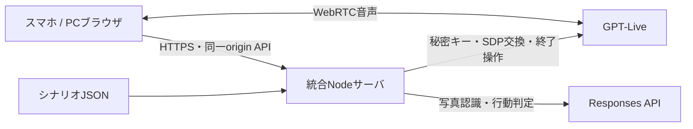

# 構成と責務

公開環境はLightsail Containersの1コンテナ・1ノードです。Web配信、認証、ゲーム状態、AI制限を同じプロセスに置きます。開発時はViteが `/api` を統合サーバへ転送し、スマホ試遊では統合サーバ1つをtunnelで公開します。

## 所有権とゲーム進行

共通の合言葉でHttpOnly Cookieを発行します。認証だけではプレイ枠を使いません。マイク許可後の開始要求で枠を確保し、最大5人が独立して進めます。ゲーム、写真、文字起こし、AI要求数はプレイごとに分離します。

開始要求から10分が絶対期限です。チュートリアルや再接続でも延長しません。ゲーム内の制限時間と、累積AI待ち・復帰待ち60秒は別に管理します。切断後の復帰猶予は最大60秒で、累積待ちが残っていなければ先に終了します。

再読込は同じ枠へ復帰します。別タブへの明示的な引継ぎでは操作世代を更新し、旧タブからの要求や遅れて到着したAI結果を無効化します。旧Liveの終了を確認してから再接続します。

## AIとの境界

プロンプトとゲーム判断はサーバ側に置きます。ブラウザへAPIキーは渡しません。任意のprovider URLやモデルをクライアントから指定するAPIはありません。

ゲーム認識・判定は `apps/local-server/game-ai.ts`、音声指示は `apps/local-server/live.ts`、進行は `game.ts`、プレイごとの接続は `hosted-runtime.ts` です。ディレクトリ名は以前のローカル構成を引き継いでいます。

写真はリクエストIDと内容ハッシュ、行動は行動IDと認識revisionで重複処理を防ぎます。写真の変換は全体1件ずつ、待機4件・最大5秒です。AI要求には同時数・回数・応答トークン上限を設けます。

## 終了と運用

期限切れ・終了・通常デプロイではLive終了を確認します。確認できない接続は枠を隔離したまま残し、新規受付へ戻しません。デプロイはdrainの完了を確認できない場合に中止します。

管理操作は独立したBearer認証を使い、ブラウザのOrigin付き要求を拒否します。HostとOriginは完全一致で検証します。ログは運用イベント、識別用ID、件数、エラーコードなどに限定し、写真・文字起こし・プロンプト・SDP・秘密値を記録しません。

状態と利用カウンタはメモリ上にあり、再起動で失われます。ホスト障害や強制停止で外部Liveの終了を保証する仕組みはありません。通常終了の検証と、絶対的な課金上限の保証は別です。審査終了後は環境を削除します。
