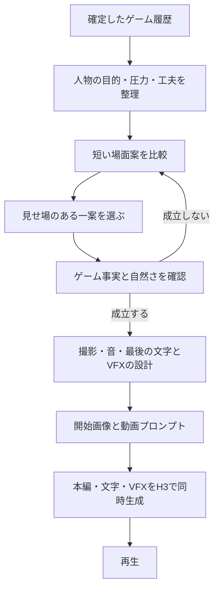

# エンディングを映画の一場面として作る制作設計

> 2026-09-13追補：入力方式とタイトル制作は[現行手順](../.agents/skills/call-to-past/references/ending.md)により更新。開始画像とタイトル入り終了画像を最後のゲーム画像から作り、道具・出口・人物・空間を引き継ぐ。以下の開始画像のみ・H3任せのタイトルに関する記述は変更前の設計記録であり、実行指示として使用しない。Web統合は未実装。

2026-09-13。設計改訂案。映画演出の試作動画は生成済み。文字入りH3動画も生成・回収済み。会話版の通常登録は開始画像のみへ対応済み。映像品質の人の評価とWeb統合は別途必要。

**プレイヤーの工夫が人物の運命を左右する、映画のクライマックスを作る。** ゲーム履歴を短縮して並べるのではなく、履歴によって生まれた状況から、一つの切迫した場面を脚色する。

本資料を今回の設計検討の入口とする。以前の品質改善案とcinema-v2の文書は撤去済み（Git履歴に保持）。cinema-v2の「矢印→カード枠」や2ショット構成も採用確定ではない。既存の送信用manifestは保留し、新しい生成の承認に流用しない。

## 1. 制作するものの定義

目標は「ゲームの結果説明」ではなく「この人物の次の瞬間を見たくなる映画の場面」。映像の直前にも物語があり、映像が終わった後にも世界が続いているように見せる。一方、今回の脱出成否は最後の場面で読み取れるようにする。

| 観点 | 新しい設計 |
|---|---|
| 場面の主語 | 道具や装置ではなく、目的を持つ人物 |
| 時間の扱い | 全履歴を均等に振り返らず、運命が変わる短い時間を選ぶ |
| アイテム | 人物の行動、状況の変化、あるいは選択の代償に役割を持つ |
| 見せ場 | 期待していたことと実際に起きることの差が、画と音で一度に分かる瞬間 |
| 映画らしさ | 人物の意図・反応、画面外の世界、連続する空間、動きの緩急で作る |
| 品質 | 面白い場面、因果が読める画、自然な挙動の三つを別々に評価する |

「cinematic」「高品質」と書くこと、黒帯、粒子、浅い被写界深度、カメラ移動の多さを映画らしさの代替にしない。

## 2. 履歴から取り出す情報を変える

現行ending-packetを根拠として、次の制作ブリーフを文章または構造化データで作る。確定事実と脚色を混ぜない。

| 項目 | 内容 |
|---|---|
| `facts` | 確定した成否、成功/失敗した行動、道具の状態、残る機構、身体の制約。各項目に元の行動/設定の参照 |
| `character_intent` | この場面で人物が何を望むか。脱出という全体目標を、目の前の具体的な望みにする |
| `pressure` | それを急がせる既存の危機、または失いたくないもの。根拠がない危機は追加しない |
| `player_contribution` | 写真と使い方の工夫が、何を可能にしたか。単なる所有品一覧にしない |
| `outcome` | 映像でも維持する結果と、未脱出ならその実際の理由 |
| `unknowns` | 手を使えるか、歩けるかなど未確定の事実。撮り方で断定を避けるか、別の場面を選ぶ |
| `dramatic_options` | 結果を変えない範囲の身振り、視線、間、画面外音のタイミングなどの脚色候補 |

人物に無理に新しい攻略操作をさせる必要はない。「探す」「見届ける」「持ちこたえる」「気づく」も場面の目的になる。ただし、15秒間ただ眺めるだけの案は別の展開を探す。

## 3. 脚本を考える順序

### A. まず異なる場面案を作る

撮影位置・秒数・カット数より先に、次の四つを一組で考える。

> 人物は何をしたい → 何を頼りにする → 何が予想を変える → 最後に何が残る

開発時には性格の異なる3案程度を比較する。たとえば「突破の瞬間」「間に合うかという時間差」「成功した工夫の意外な帰結」。同じ矢印と装置を別角度で撮るだけの案は、異なる脚本と数えない。

**最後の一拍から考える案と、プレイヤーの独特な工夫から考える案の両方を試す。** 常に失敗理由の装置から逆算すると、また装置紹介になる。

本番では複数案を文章で短く比較して一案を選ぶ設計とする。案ごとの画像・動画は生成しない。候補数やLLM呼出回数は固定せず、待ち時間を測って決める。役割分けは処理の責務であり、別モデルやサブエージェントを必須にしない。

### B. 「映画として見たいか」で候補を選ぶ

1. 最初から人物の目的と切迫感が伝わるか。
2. 結末を知らずに、次の瞬間を見たくなるか。
3. プレイヤーの工夫を別の道具に置き換えたら、場面の意味が変わるか。
4. 途中で予想が変わり、最後に強い一拍があるか。
5. 最後の画と音を一文で具体的に説明できるか。

条件を満たす案がなければ撮影設計へ進めない。全案が弱ければ、切り取る時間や中心人物の目的から変える。「安全だから静止させる」で解決しない。

### C. 確定事実と照合する

候補は事実を最初から参照する。そのうえで選択後に、追加の成功、復活した消耗品、別物になった未解除機構、拘束解除、新しい危機などを照合する。

不整合を見つけたら、面白さを担う部分を特定して代案を考える。動作を全部削って装置を映すだけにするのは避ける。同じ見せ場が成立しないなら別候補へ戻す。

### D. 最後に撮影設計とH3用文章へ変換する

ここで初めてカット、画角、被写体とカメラの動き、音のきっかけ、時間配分を決める。カット数・均等割り・長回しのいずれも既定にしない。

1ショットごとの主な情報変化を明確にし、接触動作・カメラ移動・光の変化を同時に詰め込まない。動きの起点と終点、道具の支持と作用先、画面の左右のつながりを短い文章で確認する。座標列や大量の禁止事項を主文へ流し込まない。

## 4. True / Normal / Badは場面の終わり方を変える

Trueは当面、会話版happyに相当する呼称案。ゲーム判定や隠し条件は追加しない。

| 結果 | 劇的な変化 | 最後に必要な証拠 |
|---|---|---|
| True | 工夫が最後の障害を越え、緊張が解放に変わる | 実際に脱出した状態。扉が光るだけでは不足 |
| Normal | 工夫の成果を実感した直後、その成果だけでは届かないと気づく | 達成した変化が維持され、最後の条件が残り、人物もまだ中にいる |
| Bad | 希望をかけた状況が、残る障害に阻まれたと分かる | 実際に残る障害と人物の行き詰まり。死や捕縛は別途根拠が必要 |

音の停止や人物の硬直は感情を伝える手段であり、Normal判定の根拠ではない。どのエンドも「最後に赤いランプ」で表すようなテンプレートにはしない。

NormalとBadのラベルを、初見の観客が完全に区別できるとは限らない。「何ができたか／できなかったか」の理解と、カテゴリ名の正答を別に確認する。

### 結末のあとにH3生成のエンドタイトルを表示する

ユーザーの最新方針により、本編・文字・VFXを同じH3生成へ含める。確定値`happy` / `normal` / `bad`から表示文字列`TRUE END` / `NORMAL END` / `BAD END`を選ぶ。画面内で結果の根拠を先に示し、その後に一種類だけを表示する。文字で物語のオチを置き換えない。

演出処理は`ending_graphic`として、`mode: h3_generated`、正確な文字列、開始時刻、入口の動き、静止開始、保持終了、書体・色・配置、物語の証拠を覆わない領域を設計する。これは設計上の項目であり、実装済みAPIフィールドではない。画面に固定したグラフィックとし、室内の物体や照明として作用させない。

Normalの試案は12秒で登場し、短い拡大の着地とアンバーのライトスイープを経て12.6秒から最後まで静止。VFXは文字面に限定し、未作動の案内表示を光らせない。音は既存の上階の足音に合わせる。詳細と英語例は[H3文字・モーショングラフィックスのノウハウ](research/minimax-h3/typography-motion-graphics.md)。

後付けFFmpeg合成・ブラウザ重ね表示は標準工程にしない。文字付き終了画像も要求しない。綴りの再現性は未検証で、表示失敗時にもゲーム結果を変更せず、追加生成は別の具体的な承認を得る。

## 5. 派手さと気持ちよさの設計

見せ場には、前振り、変化、反応、余韻を持たせる。尺配分は固定しない。

- 解放なら、狭かった視界が開ける、滞っていた動きが通るなど、成果を大きくする。
- 意外性なら、役立った道具の効果が別の意味を持つ瞬間を見せる。
- サスペンスなら、動きや音が積み上がり、一度に止まる瞬間を見せる。

サスペンスを選んだだけで「派手さを満たした」とはしない。大きな解放やアクションが望まれるのに既存のNormal履歴では成立しなければ、その限界を明記する。シナリオ側の見せ場の設計と、既存プレイの再映画化は別の作業。

音は環境音・物理的効果音のみ。BGMや台詞を補って成立させない。「ドーパミン」は手応え・期待・解放という体験目標として扱う。

## 6. 本番と開発を分ける

会話版の新規・再開・別版では終了画像と絵コンテ画像を生成しない。座標モデルや配置図を生成する検証ツールは撤去済み。開始画像は外見と最初の状況を合わせるもの。選んだ脚本が既存画像に合わなければ、画像を先に固定して脚本を歪めず、開始画像の構図を見直す。

開始画像のみを標準とする。旧2画像runは承認済み素材を変更せず回収・照合できる互換性を残す。利用APIの入力条件は送信時に確認する。

開発時の人による完成映像レビューは本番の毎回の前処理ではない。会話版の有料試作では実素材・条件・見積を固定して承認後に送信する。Webの費用管理・失敗時の扱いは既存の運用境界に沿って別途実装する。生成失敗でも確定済みゲーム結果は変えない。

## 7. 責務と成果物

| 担当 | 成果物 | 境界 |
|---|---|---|
| ゲーム状態 | facts / outcome / 根拠参照 | 生成AIが再判定しない |
| 脚本処理 | 目的・圧力・場面候補・選択理由 | 道具一覧をショットへ直結させない |
| 演出処理 | 行動・転換・反応・音・余韻 | 映画らしい装飾だけで済ませない |
| 整合確認 | 事実との違い、物理的懸念、修正記録 | 自己レビューを独立レビューと呼ばない |
| メディア処理 | 開始画像、最終prompt、入力ハッシュ、request ID、回収記録 | 編集・生成・採用を別状態として記録 |

Webに実装する場合、脚本・演出・設定・状態は`apps/local-server`が所有する。`apps/relay`は認証・上限・API通信のみ、`apps/web`は進捗と再生を担当する。シナリオの追加項目は`packages/shared/scenario.ts`と`scenarios/`の境界で検討する。

記録はまず`film-brief`、候補と選択理由、選択脚本、レビュー、最終入力の対応が分かる最小限にする。保存先・形式・型の正式化は実装計画で行う。新しいLLMモデル名、呼出回数、レイテンシや費用をここで既成事実にしない。

## 8. 今回のNormalを新設計で扱う場合

最初に固定するのは「矢印→カード枠」ではなく、次の素材である。

- 人物の望み：見えるようになった通路から、進む手掛かりを得たい。
- 圧力：上階から近づく音。誰がいつ来るか、捕まるかまでは確定していない。
- プレイヤーの貢献：目隠しを外し、光をもたらした。人物は周囲を認識できるようになった。
- 結果：非常案内の条件が残り、今回の脱出は成立していない。

「見えるようになったからこそ、残った問題に気づく」「見える範囲と迫る音との間に注意を引き裂かれる」など、体験の異なる場面を比較してから脚本を選ぶ。cinema-v2はその一候補にすぎない。

暗い表示を見せるだけで未脱出の理由が伝わらないなら、撮り方を足し続ける前に、機構がゲーム内でどう共有されたかを確認する。未挑戦の機構を操作失敗に変えて説明しない。

## 9. 評価と導入

開発では、人物の目的、次の瞬間への期待、道具の貢献、転換、終幕の余韻をまず脚本でレビューする。自然さと事実整合も必須だが、その合格だけで生成へ進めない。

完成動画は人に見てもらい、先に「何をしようとしていたか」「何が変わったか」「どう終わったか」を自由回答してもらう。その後に自然さ・映画の場面らしさ・退屈さ・オチの強さを聞く。道具や未脱出理由の誤読を平均点で隠さない。

タイトルについては正確な綴り、余計な文字の有無、結末より後の登場、読める静止時間、証拠の遮蔽、VFXによるゲーム内状態の誤読を確認する。文字と動画の全面禁止指示が混在しないことも送信前に確認する。撮影と文字の指示を一つの文章プロンプトにまとめる。

導入順は、①本設計に基づく複数の文章脚本比較、②一案の撮影設計と開始画像適合確認、③承認された1本の試作、④人の評価、⑤本番の処理とシナリオ設定の正式な仕様化。実装時には利用可能なSpecWorkflowで仕様→計画→タスクへ進める。現在は該当スキルを発見できておらず、正式なワークフロー実行済みとは扱わない。

現行の実行手順は[ending.md](../.agents/skills/call-to-past/references/ending.md)へ統一。通常プレイの開始画像のみの登録まで対応した。Web機能追加は行っていない。過去の試作動画・後付け文字版は比較記録として保持する。
