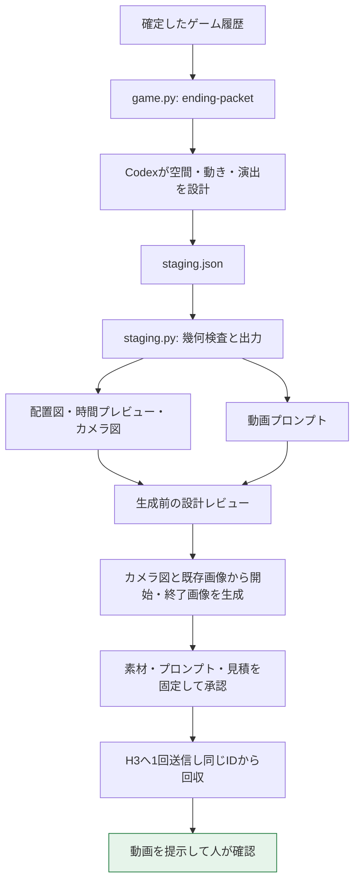

# エンディング動画生成の引き継ぎ資料

更新: 2026-09-13 JST。対象リポジトリ: `D:\Fork\OpenAI-Hackathon`。

この資料は、別のCodexセッションが現在の仕組みを理解し、同じ方針で制作・改善を続けるためのものです。現在のローカル実装と今回の実生成記録を確認してまとめています。読み込みだけで新しい生成を始める指示ではありません。

## 1. 現在の仕組み

**ゲーム履歴からAIが空間と演出を設計し、その設計データから図と動画プロンプトを出力します。図と既存のゲーム画像を参照して開始・終了画像を生成し、画像2枚とプロンプトをH3に渡します。**

対象は会話版スキル `.agents/skills/call-to-past/` です。Web試遊版 `apps/web` / `apps/local-server` にエンディング動画が統合されたわけではありません。



現状はCodexが複数のCLIと画像生成ツールを順に使う制作手順です。1つのコマンドで、履歴から完成動画まで全自動で進む実装ではありません。

## 2. ユーザーが指定したコア方針

| 観点 | 守ること |
|---|---|
| 成否 | 最後のシーンで、今回脱出できたか・できなかったかが分かる |
| 未脱出の理由 | 脱出できなかった場合は、その理由が映像から分かる |
| 緊張と情報の順序 | 最後のシーンまでは結末を確定する表現を避け、焦らしてドキドキさせる |

- カット数・時間配分は自由。3カットや5秒ずつの構成へ固定しない。
- 映像設計後、画像生成前に、上の3観点で一度以上レビューする。自己レビューでもよいが、独立レビューと呼ばない。問題・修正・再確認を記録する。
- **音は効果音と環境音だけ。セリフ・ナレーション・歌・BGMは禁止。** 原因を言葉で補足しない。
- **完成した動画の映像・音声・演出レビューは人が行う。** Codexは送信・回収・ファイルとreceiptの照合・提示まで。自動QC、フレーム抽出、視聴を追加実行しない。
- 確定したゲーム結果、残った拘束、道具、移動可能範囲を映像の都合で変えない。

「生成前の設計レビューは必要」「生成後の内容レビューは人が担当」は別の話です。

## 3. AIが考える部分とコードで決まる部分

| 担当 | 内容 |
|---|---|
| `game.py` | 行動と成否の履歴、解除数、エンド種別、未解除機構の根拠 |
| Codex | 履歴を読んでプロット、空間配置、支持方法、軌道、カメラ、各場面の動作と音を考える |
| `staging.py` | AIが作った設計JSONを検査し、図・プレビュー・動画プロンプトへ変換する。内部でLLM/APIは呼ばない |
| Codex | 3観点の設計レビュー、画像生成用プロンプト作成、ツール間の進行 |
| Codex内蔵imagegen | カメラ図と外見参照から開始・終了画像を生成。記録上、内部モデル名は非公開 |
| `media.py` / `generate_h3.py` | 素材と見積の固定、取得済み承認の記録、falへの送信、同じIDからの回収 |
| 人 | 完成映像が自然か、結果と理由が伝わるか、採用するかを判断 |

プロンプトを全て機械的に発明するわけではありません。位置・寸法・距離・速度・カメラ値はデータから文章になりますが、`action`、`sound`、外見・支持の説明などはCodexが設計してJSONへ書く文章です。

## 4. ゲーム履歴を動画制作へ渡す

`game.py ending-packet` は終端に達したプレイから、舞台・初期伏線、各行動の意図・成否・理由・結果画像、在庫、エンド種別などを取り出します。

エンド種別はコードで固定されます。

| 解除数 | 種別 | 映像で守る結果 |
|---|---|---|
| 3 | happy | 脱出成功 |
| 2 | normal | 今回は未脱出。部分的な成果はある |
| 1以下 | bad | 脱出失敗 |

追加した `escape_evidence` には `escaped`、`action_limit_reached`、`remaining_obstacles` が入ります。残った障害ごとにid・名前・観察・機構・試行したかを渡します。未挑戦を「試したが失敗した」と描いたり、表示装置を扉ロックに置き換えたりしないためです。これらは終端の制作内部用であり、プレイ中の公開contextへ全障害を出すものではありません。

`story.json` は `title`・`story`・`evaluation` の3文字列です。物語の土台とリザルト表示用であり、自動的に読み上げられるナレーションではありません。

## 5. 空間設計の実装

**現在の実装はThree.jsではありません。** Python標準ライブラリでJSONを処理し、HTML/SVGの平面図・側面図・時間プレビュー・簡易透視図を作っています。目的は「設計した物理空間と動きを根拠に、矛盾の少ない文章を書くこと」です。

### 入力JSON

| フィールド | 意味 |
|---|---|
| `version`, `duration` | スキーマ版と動画尺。今回version 1、15秒 |
| `room` | 室内の幅・高さ・奥行き。単位m、原点から正方向 |
| `assumptions` | 実測でない寸法・支持など、演出上置いた仮定 |
| `continuity`, `outcome` | 外見の継続条件と、変えてはいけないゲーム結果 |
| `entities` | id、名前、説明、直方体の寸法、支持方法、固体か、時刻ごとの中心座標 |
| `keys` | `t`と`position`。位置はキー間を直線・等速で補間 |
| `allow_contact` | 肩に載る猫など、意図した接触を許すidペア |
| `max_speed` | 設計で許す移動速度の上限 |
| `shots` | 開始/終了時刻、カメラ位置、注視点、縦画角、動作、音 |
| `reveal` | 最後に見せる装置のid群と、見せ始める時刻 |

座標は **x=右、y=上、z=奥**。寸法と位置は粗い直方体で扱い、カメラはショット内で固定、ショット間は明示カットです。滑らかなカメラ軌道・回転軌道・人体リグは、この版には実装されていません。小さな顔の向きや光の向きは演出文に含まれ、幾何検査の対象外です。

### 出力

- `staging.json`: 入力のコピー。
- `checks.json`: 元データのSHA-256、検査結果、保証しない事項。
- `preview.html`: 上から・横からの配置図。時刻スライダーと再生で物とカメラを確認。
- `shot-N-start.svg` / `shot-N-end.svg`: 各ショット開始・終了のカメラ図。
- `video-prompt.txt`: 同じ座標・軌道・演出から出した英語プロンプト。

出力先は新規フォルダのみで、既存の成果物を上書きしません。今回のカメラ図PNGは、出力SVGをPlaywright/Chromiumで表示して保存したものです。PNG化自体は `staging.py` に組み込まれていません。

### 検査できること・できないこと

検査するのは、入力数値・時刻の整合、室内境界、速度上限、直線移動中の直方体同士の食い込み、カメラと固体の食い込み、前半の画角へ結末装置が入る危険です。画角検査は固定装置を境界球で保守的に判定し、遮蔽物による隠れは考慮しません。

力学、人体の変形、把持、支持力、光・反射、最終画面の読み取りやすさは保証しません。`support`は説明、`allow_contact`は指定ペアを衝突検査から除く仕組みであり、支持が力学的に成立するかを解くものではありません。数値検査の成功は演出レビューの合格でもありません。

## 6. 開始・終了画像とH3

画像生成では、**カメラ図を配置と構図の根拠、直前のゲーム画像を人物・道具・材質の根拠**として渡します。開始画像には結末を出さず、終了画像には成否と未脱出の理由に必要な物を置きます。2枚のピクセル寸法・縦横比を揃えます。

生成画像は図の厳密レンダリングではなく、配置・大きさに誤差が出ます。今回もその旨を `image-generation.json` に残しています。H3へ渡すのは生成画像2枚と文章であり、JSON・設計図・プレビュー動画をH3に直接渡して物理的に拘束する構成ではありません。

| 項目 | 現在の標準 |
|---|---|
| endpoint | `minimax/h3-max-turbo/image-to-video` |
| 経路 | fal経由の開始/終了画像付きI2V |
| 尺・解像度・本数 | 15秒・768P・1本 |
| `prompt_expansion_mode` | `balanced` |
| seed | ユーザーが指定した場合のみ |
| 主な入力 | `prompt`, `image_url`, `end_image_url`, `duration`, `resolution` |

ローカル送信コードは完成済みプロンプトを読み、別のLLMで書き直さずAPIへ渡します。ただしH3側にはprompt expansionの設定があり、「送った文章がモデル内部でも一切変換されない」という意味ではありません。

### 外部送信と認証

1. `estimate_cost.py`で最新の価格・為替から見積を作る。
2. `media.py prepare`でプロンプト、開始/終了画像、見積をコピーし、寸法・全文・ハッシュを `approval-manifest.json` に固定する。
3. 具体的な素材・プロンプト・料金・条件を提示して承認を得る。`approve`は取得済みの承認を記録するだけ。
4. `submit`を1回実行する。曖昧失敗でも自動で再送しない。
5. 保存されたrequest IDを使い`status` / `result`で回収する。動画と `receipt.json` を保存して提示する。

当環境のユーザー指定のキー名は **`FAL_KEY_OPENAI_HACKTHON`**（綴りそのまま）です。今回の実行ではProcess→User→Machineの環境変数からこの名前を探し、子プロセスに渡す `FAL_KEY` へ設定しました。CLIがこの別名を自動認識する改修はしていません。キー値は表示・記録しないこと。ルート `.env` はAGENTS.mdで読み込み禁止です。

認証・課金条件の詳細は[H3手順](../.agents/skills/call-to-past/references/h3-cli.md)を参照してください。過去の承認を新しい素材・別の1本へ流用しません。

## 7. 最後に実行した試作

元セッションは `ctp-20260911T181525Z-e809be41`。4行動で2解除、normalです。マジックハンドで目隠しを外し、iPhoneで暗い通路を照らしました。非常表示のカード枠は未挑戦のまま残りました。

最新の試作は **`20260913-spatial-v1`**。その中の採用設計入力は **`staging-v3.json`**、コンパイル出力は **`compiled-v4`** です。「採用設計入力」は今回送信に使った設計を指し、ユーザーによる完成映像の採用を意味しません。

| 時間 | 設計 |
|---|---|
| 0〜4秒 | 人物・猫・スマホを固定。光と矢印で期待を持たせる |
| 4〜7秒 | スマホだけ右へ0.45m、0.15m/sで移動 |
| 7〜10.5秒 | スマホは停止。足音と視線で緊張を維持 |
| 10.5〜15秒 | カメラを明示カットで切り替え、空のカード枠と未点灯表示を初めて見せる |

人物と猫は並進せず、スマホの軌道は壁から余裕を取っています。未来AIが道具を保持する浮遊は既存の作品設定です。通常の重力による支持とは区別しています。

### ローカルの実例

以下はこのPC上の実ファイルです。`runs/`はGit管理外のため、別PCへリポジトリをcloneするだけでは入手できません。

| 資料 | リンク |
|---|---|
| 空間設計JSON | [staging-v3.json](../runs/call-to-past/ctp-20260911T181525Z-e809be41/ending-remakes/20260913-spatial-v1/staging-v3.json) |
| 時間プレビュー | [preview.html](../runs/call-to-past/ctp-20260911T181525Z-e809be41/ending-remakes/20260913-spatial-v1/compiled-v4/preview.html) |
| 動画プロンプト全文 | [video-prompt.txt](../runs/call-to-past/ctp-20260911T181525Z-e809be41/ending-remakes/20260913-spatial-v1/compiled-v4/video-prompt.txt) |
| 設計レビュー | [ending-design-review.md](../runs/call-to-past/ctp-20260911T181525Z-e809be41/ending-remakes/20260913-spatial-v1/ending-design-review.md) |
| 画像生成のプロンプトと参照 | [image-generation.json](../runs/call-to-past/ctp-20260911T181525Z-e809be41/ending-remakes/20260913-spatial-v1/image-generation.json) |
| 送信した画像・見積・全文 | [approval-plan.md](../runs/call-to-past/ctp-20260911T181525Z-e809be41/ending-remakes/20260913-spatial-v1/approval-plan.md) |
| 生成動画 | [ending.mp4](../runs/call-to-past/ctp-20260911T181525Z-e809be41/ending-remakes/20260913-spatial-v1/h3-001/h3/retrievals/20260912T160634219748Z-32ed40a4/ending.mp4) |
| 回収証跡 | [receipt.json](../runs/call-to-past/ctp-20260911T181525Z-e809be41/ending-remakes/20260913-spatial-v1/h3-001/h3/retrievals/20260912T160634219748Z-32ed40a4/receipt.json) |

request ID: `01a0965e-a1db-7ba3-ad94-4f61280a3060`。1回送信して回収済み、ファイル26,610,331 bytes。送信前見積は0.15 USD・約23.03円でしたが、これは当時の条件であり次回価格や実請求額の保証ではありません。

前の `20260913-core-v1` は空間設計導入前で、最後に日本語の声を入れた旧版です。今回の現行方針の見本として流用しないでください。

## 8. 何を確認できたか

| 項目 | 状態 |
|---|---|
| Pythonテスト | 実装時70件成功。現在の資料作成では再実行していない |
| プレビュー | 実装時に時刻操作、物体移動、カット変更、再生、JSエラーなしを確認 |
| 空間図と演出 | 生成前の自己レビュー実施。人物による遮蔽や画角外を直した |
| 開始・終了画像 | 内蔵imagegenで各1枚を実生成、両方1672×941 |
| 実API | 空間設計→テキスト→画像→H3送信→ファイル回収を通した |
| 物理的な動きの改善 | **未判定** |
| 完成動画の演出・音声、3観点 | **人の確認待ち。Codexによる動画レビューは未実施** |
| ユーザーによる採用 | **未確認** |

通常の新規プレイでは `attach-story` → `attach-ending` → `attach-video` → 動画提示 → `mark-video-shown` → `result` と登録します。なお、liveの `attach-video` には既存のreceipt照合・ffprobe技術検査が組み込まれています。これは人が行う内容レビューとは別です。

今回のように終了済みプレイを作り直す場合は、`ending-remakes/<revision>/`へ別版を保存し、既存stateと登録済み物語・画像・動画を上書きしません。最新の試作動画も旧stateへ差し替えていません。

## 9. 引き継ぐセッションが読む順番

1. [プロジェクトAGENTS.md](../AGENTS.md)：正本・秘密・既存変更の扱い。
2. [SKILL.md](../.agents/skills/call-to-past/SKILL.md)：会話版全体の進め方。
3. [ending.md](../.agents/skills/call-to-past/references/ending.md)：エンディングのコアと制作順。
4. [spatial-staging.md](../.agents/skills/call-to-past/references/spatial-staging.md)：空間設計の契約と制約。
5. [staging.py](../.agents/skills/call-to-past/scripts/staging.py)：検査・図・プロンプトの実装。
6. [h3-cli.md](../.agents/skills/call-to-past/references/h3-cli.md)：承認・一度送信・回収。
7. [検証記録](../specs/call-to-past/verification.md)と上記の最新実例。

作成時点では、今回の空間設計関連のコード・資料に未コミット/未追跡の変更があります。他セッションの既存変更を上書きせず、着手時に `git status --short` を確認してください。別PCで使うならコード類に加え、必要な実例だけを明示的に移す必要があります。

### 無課金で仕組みを試すコマンド

以下は既存素材を再生成・上書きせず、設計コンパイラを新規の出力先で試します。`handoff-compiled-001`が既に存在すれば別の未使用名へ変えてください。

```powershell
$CallToPast = 'D:\Fork\OpenAI-Hackathon\.agents\skills\call-to-past'
$Revision = 'D:\Fork\OpenAI-Hackathon\runs\call-to-past\ctp-20260911T181525Z-e809be41\ending-remakes\20260913-spatial-v1'
py -X utf8 "$CallToPast/scripts/staging.py" --input "$Revision/staging-v3.json" --output "$Revision/handoff-compiled-001"
```

この実行はLLM・画像・動画APIを呼びません。素材・参照・スクリプトは読み込んだSKILL.mdの親を基準、プレイ保存先は作業フォルダを基準に解決してください。

## 10. 再導入しないもの

- 3カット固定、5秒均等割り、開始と終了の大きな差だけを目的にする設計。
- 失敗理由をセリフで説明する構成。
- 終了画像を先に見せる、救援や成功/失敗を前半の音で確定する演出。
- 「図を作ったので生成動画の物理も正しい」「回収成功なので改善した」という報告。
- JSONを渡せばH3がその空間を直接シミュレーションするという説明。
- 今回の試作をWeb版へ実装済みとする説明。
- 完成動画への自動的な追加QCや、承認なしの再生成。
