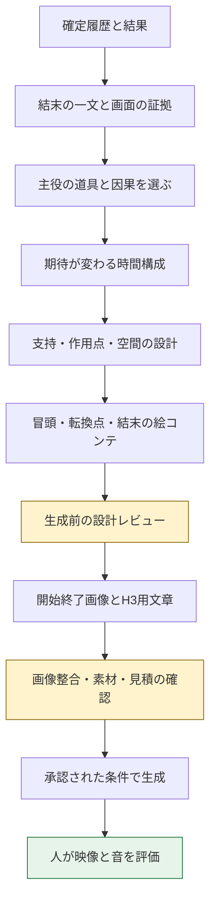

# エンディング動画の制作クオリティ改善案

最新の設計検討は[映画の一場面を作る制作設計](ending-film-production-design.md)。本資料は初期分析として保存し、制作順序は新案で再検討する。

最新の脚本改稿は[映画の一場面としての再構成](ending-cinema-rewrite.md)。人物の視線と反応を軸に、カメラの前進→切替→停止で期待を変える案へ更新。前の送信案は保留、改稿版は未送信。

2026-09-13。状態：設計検討。実装・生成・映像改善の検証は未実施。

追記：同日のユーザー相談を受け、比較試作は開始画像のみ・エンドフレームなしへ変更。本番では画像の絵コンテ/配置図を生成せず、文章で結末・道具の役割・演出を設計する方針。絵コンテは開発検証用の任意資料とする。以下の図や手順の絵コンテ/終了画像は初期案であり必須ではない。試作向け`media.py`の終了画像省略と回収照合は無課金テスト26件成功、開始画像は内蔵imagegenで1枚作成。H3は未送信で、改善効果は未検証。通常プレイ登録・Web実装は未対応。

**プレイヤーの工夫が何を変えたかを見せ、その成果と限界が最後の大きな見せ場で分かる短編にする。** 道具の一覧から映像を作るのではなく、「観客が最後に理解すること」から、必要な道具・作用・構図を逆算する。

対象は、まず会話版の制作手順。Web版への統合は別機能であり、本資料はWebの正本やゲーム結果の判定を変更しない。

## 1. 現状の問題と対策

根拠は[引き継ぎ資料](ending-video-handoff.md)、[撮影技法の調査](research/minimax-h3/cinematography.md)、最新試作の`staging-v3.json`・送信プロンプト、`staging.py`。完成映像は視聴・フレーム抽出していない。映像への不満は今回のユーザー報告、以下の原因分析は制作入力からの診断である。

| 問題 | 確認できた設計上の要因 | 改善案 |
|---|---|---|
| iPhoneが宙に浮く | 「見えない未来AIが保持する」が支持方法として明記されている | 浮遊を見せない構図を優先。保持が必要な画では、設定・拘束と両立する支持を目で分かる形にする |
| 退屈 | 0〜10.5秒が固定カメラ。人物と猫は固定、スマホが少し動いた後、最後に未解除装置を提示 | 各場面で観客の理解か期待が変わる構成にする。静止時間にも問いを持たせる |
| 道具が意味なく置かれる | マジックハンドは停止した脇役として全体指示に入る | 因果に寄与する道具だけを主役にする。全アイテムの登場を必須にしない |
| オチが弱い | 小さな空の枠と未点灯装置が主な結論 | 結末の根拠を主役にした画角へ切り替え、成果と未解決を同時に読ませる |
| 幾何検査を通しても不自然 | `support`は文章、`allow_contact`は衝突除外。支持力・把持・光は未検査 | 支持・作用・光源を別々に設計レビュー。幾何合格と映像自然さを分ける |
| 品質指定を足しても直らない | 現在の出力は大量の座標・静止条件をそのまま動画文へ展開。冒頭は`realistic cinematic 3D`固定 | 詳細な空間データを保持しつつ、H3へは画面で見える関係と変化を優先して出力。画風は参照に合わせる |

浮遊は「H3の物理表現を直せば解消する」とは言えない。現在は指示どおりでもユーザーが不自然と感じる。旧設定を映像化する方法そのものを見直す必要がある。

## 2. 結末を先に設計する

最初に「最後の画を見た観客に言ってほしい一文」を決める。その一文の証拠が画面になければ、撮影へ進めない。

現行会話版は3解除=`happy`、2解除=`normal`、1以下=`bad`。今回のTrueは、設計上は既存`happy`に対応する呼称案とする。隠し条件や新しい真エンドは追加せず、コードの列挙値も変更しない。

| 呼称案 | 最後に分かること | 見せ場の方向 | 避けること |
|---|---|---|---|
| True（既存happy） | 工夫が最後までつながり、脱出した | 局所的な作用から、開けた空間・安全側にいる身体へ一気に展開。解放の大きな変化 | 明るい扉だけで成功扱い。履歴にない救援・新能力 |
| Normal | 工夫は役立った。しかし最後の一条件が残り、まだ中にいる | 小さな成功の快感→期待が膨らむ→最後に一つ足りないと分かる「惜しい」落差 | 脱出成功に見える締め、成功済みの成果を故障させて帳消しにする |
| Bad | 残った障害がなお脱出を阻んでいる | 通れると思った構図が、最後に拘束・遮断を大きく示す構図へ変わる | 解除数だけを根拠に死亡・崩落・捕縛を創作する |

Trueの解放、Normalの惜しさ、Badの行き詰まりで、観客の感情を分ける。Badでも「何が原因だったか分かった」という納得と、鮮やかな幕切れを報酬にできる。

ただし、NormalとBadはどちらも未脱出。名称を知らない観客が映像だけで厳密なカテゴリ名を答えられる保証はない。現在の3障害の意味をゲーム内で共有し、終幕で「進んだ状態」と「残った障害」を見せる必要がある。新規シナリオでは、解除状態を外見で判別できる機構を用意する。これは後続のシナリオ設計案であり、既存プレイへ新しい装置を足す理由にはしない。

## 3. 起承転結を「観客の理解の変化」で作る

次の4段階は意味の構成であり、4カット固定ではない。

1. **起：問いを置く。** 道具と作用先が分かり、「これが役立つか」と思える画。
2. **承：工夫が効く。** 接触・照射などの原因と、小さくても明瞭な結果を見せる。
3. **転：その成果の意味が変わる。** 見える範囲が広がる、最後の条件が現れるなど、観客の予想を更新する。
4. **結：結果を大きく提示し、読める時間を残す。** 脱出、惜しい未脱出、障害による失敗を確定する。

過去の成功動作を描く場合は、過去の出来事の再現として設計に記録する。終端後に同じ操作をもう一度行わせない。15秒で履歴全体を再演せず、結末に効く一つの因果を選ぶ。

「ドーパミンが出る」は医学的効果の主張ではなく、期待・手応え・解放・意外性を求める体験目標として扱う。

### 気持ちよさを作る演出

| 段階 | 映像 | 音 |
|---|---|---|
| 溜め | 狭い構図、結果が見えない作用点、止まる直前の動作 | 小さい接触音と環境音。無関係な効果音を足さない |
| 手応え | 布が外れる、光で物が読めるなど、一つの変化が完了 | 動作と合った一音。材質と音源が分かる |
| 大きな変化 | 寄り→広い構図、遮蔽→全貌、暗部→既存光源で見える範囲の拡大 | 既存の環境音が空間に応じて広がる。カットをまたぐ物理音 |
| 余韻 | 結末の根拠を保持。最後に新しい謎を足さない | 残響や室内音へ戻る |

派手さは「同時に多くを動かすこと」より、溜めとの落差と画面占有率で作る。最後の一回に最大の構図変化を集める。音量を上げるだけにしない。読解用のホールドは15秒なら約2〜3秒を初期案とし、人の反応で調整する。

顔の表情、台詞、ナレーション、歌、BGM、字幕やエンドラベルには頼らない。爆発・火花・警報・扉の閉鎖は、履歴と舞台に根拠がある場合だけ使う。

## 4. アイテムは「作用」でキャスティングする

道具ごとに、次の一行を書けるか確認する。

> この道具が、この場所のこれに作用したので、この変化が起こり、最後の結果につながった。

| 設計項目 | 内容 |
|---|---|
| 履歴の根拠 | 行動ID・実際の使い方・成功/失敗・消費/破損状態 |
| 役割 | 主因／結果の証拠／脇役／画面に出さない |
| 支持 | 誰のどの手、どの面、どの固定部が支えるか。設定上不明なら不明と記す |
| 作用点 | 接触する箇所、照らす箇所、変化の対象 |
| 観客に見える証拠 | 道具の名前を知らなくても何が起きたか分かる画 |
| 前後の状態 | 登場前、動作中、終端。持ち手・向き・場所が飛ばない |

「画面から消しても理解が変わらない」道具は原則省く。履歴や在庫から削除するのではなく、フレームに入れない。複数道具の組合せが攻略の核なら、接続関係が読める範囲で複数を使う。

### iPhoneの具体策

- 新しいシーンで手が使える根拠がある：手と端末の接触を冒頭の参照画像で見せる。持ち替えを減らす。
- 既存拘束や旧設定により手持ちを断定できない：端末全体の浮遊を見せず、画面端の部分像と照射先で機能を示す。保持方法が見えないことを、物理検証済みとは扱わない。
- 台に置く・固定具を付ける：実際に置ける面と、その状態へのつながりが必要。支持を直すためだけに新しい攻略行動や道具を増やさない。

今回の既存プレイでは、二番目が最も変更の少ない候補。光源方向と端末の向きを合わせる。光だけを浮遊させるような見せ方も避ける。

## 5. 直近のNormalをどう組み直すか

確定事実：マジックハンドで目隠しを外した。iPhoneで暗い通路を照らした。非常表示のカード枠は未挑戦、未解除。2解除・4行動で未脱出。カード枠は扉ロックではない。

**観客に理解してほしい一文：『照らせるようにはなった。でも案内装置を動かす条件が残っていて、まだ出られていない。』**

以下は撮影案。既存の実画像との整合は画像制作前に確認する。新しい攻略動作・人物の歩行・装置の故障は加えない。

| 時間の例 | 画と変化 | 観客の理解 |
|---|---|---|
| 0〜2.5秒 | 画面端に端末の一部、奥にはそれが照らしている通路。持ち替えや再点灯はせず、すでに照明に成功した状態から始める | この道具で暗闇を見えるようにした |
| 2.5〜7秒 | 光の届いた既存の矢印へカット。光源と矢印の位置関係を継続し、人物の背面を必要な範囲だけ残す | 道筋の手掛かりは見えている。その先はどうなったか |
| 7〜10秒 | 矢印から先の情報は画角外。環境音を保った短い溜め。静止が長ければここを削って前後に配分 | 見えていない先への期待 |
| 10〜12秒 | 空のカード枠と未点灯の案内表示が大きく読める構図へ明示カット。スマホの反射光と表示自体の発光を混同しない | 照らすことと、装置を動かすことは別だった |
| 12〜15秒 | 最後の構図を保持。前景に室内に留まる人物、主要部に空の枠と不作動の表示。照明の成果は維持 | 工夫は有効だったが、最後が足りず未脱出 |

マジックハンドはこの因果の主役ではないため無理に入れない。目隠しが外れている状態を連続性として残す。道具二つの活躍を同時に振り返るより、iPhoneの「役立った範囲と限界」を中心にする。

この履歴には大規模な事件の根拠が少なく、**この再構成だけで「派手なオチ」を十分に満たすとは断定できない**。まず因果と不自然さを改善する案である。案内装置と未脱出の関係を画で読めなければ設計を差し戻す。未挑戦なのにボタン操作・エラー音を足して説明しない。

今後すべてのエンドで派手な顛末を求めるなら、シナリオ側に「脱出時に開ける場所」「最後まで残る障害の見た目」「既に起きた結果の見せ場」を設定する必要がある。生成段階だけに背負わせない。

## 6. 制作パイプラインの提案

既存の空間設計の前に「結末・道具・情報の順序」を置く。転換点の絵コンテは内部設計資料であり、現在のI2Vに三枚目の画像を渡せるという意味ではない。

### 追加する設計データ案

| データ | 用途 |
|---|---|
| `outcome_contract` | ゲームが確定した結果・未解除根拠。制作側は書き換えない |
| `payoff` | 結末の一文、見える証拠、初めて判明する場面、余韻 |
| `prop_roles` | 行動への参照、登場意図、支持、作用先、状態遷移 |
| `beats` | 各区間の期待・新情報・音源・原因と結果・履歴再現か終端状態か |
| `shots` | 対応するbeat、構図、被写体動作、カメラ動作、隠す情報と見せる情報 |
| `style_anchor` | 参照画像の画風、材質、光、色。実写と3Dの指示を混ぜない |

実装するなら、存在しない行動ID、矛盾した成否、消費済み道具の復活、根拠のない解除、未指定の支持、時刻不整合を検出する。意味のない登場や納得感は自動判定だけで合格にしない。

現行`staging.py`は固定カメラと直線移動の設計。移動カメラを追加するなら位置と注視点の時間変化、途中の視界・衝突検査、プレビューを同時に拡張する。文章だけに移動を足して図と乖離させない。初回案は固定構図と明示カットで成立させられる。

### H3への出力

世界座標などの詳細は設計・検査用として残す。動画用文章には「何が見え、どれが動き、何が変わり、次に何が分かるか」をショット順に書く。全物体の全座標を毎回並べる方法から、必要な空間関係を選んで伝える方法を比較する。省略により情報が失われないよう、各ショットと元データを追跡可能にする。

公式ガイドは開始終了画像間の変化を具体化し、複数ショットは明示し、カットに新しい情報を持たせる方針を示している。`integrated_multimodal_description`、`overall_soundscape`、`non_diegetic_music`に整理する候補とする。これは記述形式であり、新たなAPIフィールドやタイミングの保証ではない。[MiniMax公式ガイド](https://huggingface.co/MiniMaxAI/MiniMax-H3/blob/main/docs/VIDEO_PROMPT_WRITING_GUIDE_base_en.md)

ローカル調査の技法では、05「作用が見える俯瞰」、11「原因と結果の接続」、01/02/13「情報の公開」、09「残された状態」が本件に適する。名称より構図と到達点を指定する。ピント送りだけで結末を隠せたことにしない。詳細は[撮影技法の調査](research/minimax-h3/cinematography.md)。各技法のH3再現性は未検証。

## 7. 生成方式の選択

| 案 | 利点 | 限界・追加負担 | 判断 |
|---|---|---|---|
| 現行I2V・15秒1本で構成を改善 | 既存手順で試せる。制作変数を抑えられる | 中間の作用・カット・音同期は生成に委ねる | 最初に試す |
| ショット別にH3生成し、編集で接続 | カット時刻・間・音・不採用ショットを人が制御できる | 複数生成、接続の整合、費用・待ち時間・編集工程が増える | 一括生成で見せ場が崩れる場合の第二段階 |
| モデル・解像度・参照方式を変更 | 細部や動きの比較候補になる | 因果が弱い脚本は解決しない。提供条件の確認が必要 | 演出を固定して別途比較 |

ショット別案は将来案。完成動画をCodexが自動で解析・編集する現在の許可ではない。人が採用区間を決める運用と素材・音・結合後の記録を別途設計する。短いクリップでも比例して安くなるとは見積もらず、実行前に利用可能な尺・課金条件を調べる。

## 8. 検証と実装の順序

### 生成前の合格条件

- 各道具の登場理由を、実際の行動と画面の変化で説明できる。
- 支持・接触・光源が図と画像で矛盾せず、未確認の人体拘束を勝手に解除しない。
- 中盤に期待または理解の変化がある。単なる待機は削るか理由を示す。
- 最後の場面に、結果と未脱出理由の視覚的根拠がある。序盤の映像・音は結末を確定しない。
- 開始・転換点・終了の状態が連続する。開始終了画像だけで中間も保証したことにしない。
- 最大の演出変化と、読解できる余韻が両立する。

自己レビューは自己レビューと記録する。素材整合の合格と完成映像の採用を分ける。

### 人による完成映像の評価案

結果名を伏せて見てもらい、「何が役立ったか」「最後にどうなったか」「未脱出なら何が残ったか」を先に自由回答してもらう。次にTrue/Normal/Badの選択と理由、自然さ・退屈さ・オチの強さを記録する。数値評価は補助とし、意味不明な道具や支持破綻がある作品を平均点で通さない。

少人数の試遊では統計的優劣とせず、誤読の内容を次の修正に使う。まず同じNormal履歴、同じ画風・API条件で改稿版を評価する。脚本変更の比較であることを明記し、モデル性能のA/Bとは呼ばない。以後の再試作は主な変更点を一つ選ぶ。

### 実施順

1. 無課金で、直近Normalの結末・道具役割・絵コンテを具体化する。ここで分かりにくければ生成しない。
2. 制作手順と出力形式の変更を正式に仕様化し、履歴の根拠と結果の不変性を検証する。
3. 具体的な画像・プロンプト・最新見積・条件がそろった1本を、承認範囲で生成する。
4. 人の評価を受け、因果・自然さ・見せ場を確認する。
5. True/Badはそれぞれ実際の確定履歴で検討する。Normalの履歴を書き換えて比較用動画を作らない。

本資料作成ではAPI送信、画像生成、動画視聴、既存stateの更新を実施していない。正式な実装段階ではSpecWorkflowの仕様→計画→タスクへ進む。今回は該当スキルを発見できず、SpecWorkflow実行済み・承認済みとは扱わない。

## 9. 後続で決めること

- Trueが既存happyの表示名か、別の真エンドを意味するか。本案は前者を仮置き。
- 今後の通常プレイで、道具の支持をどう視覚化するか。今回の改稿では浮遊する全体像を避ける。
- Normal/Badの区別をシナリオのどの機構・状態に担わせるか。
- 派手な結果のためにシナリオを拡張する範囲。既存プレイの再制作とは分ける。

Web版は結果を先に通知してから動画を出す合意がある。「最後まで伏せる」は本案では動画内部の演出を指し、Webの結果通知順を変更しない。
