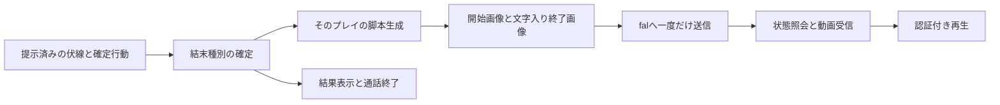

# Web版エンディング動画の実装計画

Status: approved (2026-09-14)

2026-09-14。分岐とプレイ固有の物語生成を確認後、「よし、それで進めて」と計画全体の承認を受領。実装・検証を進める。

## 方針

単一Nodeサーバーのハッカソン用公開構成に追加する。ゲームが結末種別と行動結果を確定し、提示した伏線・行動履歴から物語と演出を生成する。開始・文字入り終了画像からfal H3の15秒動画を作り、所有者だけがWebで再生する。

調査は[research.md](research.md)、型と寿命は[data-model.md](data-model.md)、追加HTTP APIは[contracts/openapi.json](contracts/openapi.json)を参照する。

## P1: 結末とプレイ固有の材料を固定する

変更: `apps/local-server/game.ts`、`apps/local-server/hosted-runtime.ts`、`packages/shared/game.ts`。新規: `apps/local-server/ending.ts`、`apps/local-server/story-evidence.ts`、`packages/shared/ending.ts`。

- `GameSession`に完全解除IDと確定行動履歴を持たせ、`judgeAction()` / `commit()`の両方で成功の記録→勝利判定→回数切れ判定の順にする。ゲーム時間切れと中断の終了理由を区別する。
- `StoryEvidenceLedger`で初期説明、提示した状況・結果、受信したAI文字起こしを保持する。表示履歴の間引き・操作権移動に依存させない。根拠なしの人物や事件を終了時に追加しない。
- `GameRuntime`の終了callbackでfactsを固定する。最終行動に対応する画像messageIdを事前に決め、結果画像の登録前にendedが走る順序でも紐付けを失わないようにする。
- 同期の終了処理中にエンディング専用permitを登録する。通話retire後に新しいプレイ権限を作り直さない。最大12秒の既存の終了猶予で後着文字起こしを回収し、準備済みpacketを一度だけ封印する。
- 不完全な物語材料はフラグを付け、残っている提示事実だけから結末を生成する。舞台別固定文を正常系にも失敗時にも使用しない。

## P2: 脚本と2画像の制作

新規: `apps/local-server/ending-ai.ts`、`packages/server/ending-image-service.ts`。変更: `packages/server/openai.ts`、`packages/server/ai-service.ts`、`packages/server/ai-config.ts`。

- 提示履歴は最大512KiB、1チャンク96KiB以下・最大6チャンクに分けて出典付きの伏線を抽出し、全行動の確定結果と合わせる。1抽出は最大2,048出力tokens、脚本は最大4,096出力tokens。チャンク欠落や不正sourceIdを検出する。履歴が短い場合は抽出を省いて脚本入力へ直接含める。
- `EndingDesign`には採用sourceId・行動ID、候補比較、物語、演出、2画像と動画のpromptを含める。事実・文字列の整合性を検証する。舞台設定は背景として扱い、未提示の伏線を既知の話にしない。
- Ending用Responsesを専用validatorとpermitで許可する。文字入力は1要求最大128KiB、参照JPEGは最大2枚・各1MiB。既存の一般Responses 1,000tokens・文字入力16,000文字上限を一括で緩めず、全体のResponses予算・並列制限に計上する。抽出・脚本の送信はそれぞれ1回で、不正出力・通信失敗の自動再送を行わない。
- `OpenAITransport.createImageEdit()`でmultipartの画像編集を追加する。既存IMAGE_MODEL、low、1024x1024、JPEG、1枚を初期値とし、検査済みの参照画像を最大2枚渡す。ルート`.env`やデモCLIを実行しない。
- 終了callbackで完成・検査済みの場面画像を固定する。最終画像を待たず、終了時のgameVersion以下で最新の完成画像を人物・道具・舞台の参照に使う。同じversionなら後の場面を優先し、完成順では選ばない。直近最大2行動の行動前画像も同時点で固定し、後着画像を追加しない。古い画像のversionと目標factsを脚本・画像編集・検査へ明示し、確定した変化を反映する。完成画像が1枚もない場合だけ素材不足として止める。既存12秒の文字起こし猶予は維持する。
- 開始画像と終了画像は順に生成する。各画像は最大2回（初回と修正1回）、重大な状態矛盾・文字・両端の連続性を検査する。終了画像検査には開始画像も使い、生成・検査は既存の全体予算と並列制限を共有する。画像のリクエストが受理されたか不明な通信失敗は再送対象にせず、明確な検査不合格を修正再生成の対象にする。
- 映像に採用する行動は原則直近最大2件。序盤の伏線は物語の入力に残す。行動前の見た目の根拠が足りなければ行動後の反応から描く。

## P3: fal transportと有限ジョブ

新規: `packages/server/fal.ts`、`apps/server/ending-jobs.ts`。変更: `apps/server/config.ts`、`packages/server/ai-service.ts`。

- fal transportはinject可能にし、実実装は標準fetchを使用する。固定endpointへのPOSTのみ許可し、認証は`Authorization: Key ...`。モデル・15秒・768P・balanced・2画像・安全検査をサーバーで固定する。
- submit開始前にattemptを消費して固定し、`X-Fal-No-Retry: 1`を付ける。POST結果が曖昧なら再送せず失敗とする。request ID取得後は検証済みの照会URLでstatus / resultを回収する。
- API応答URLは`https://queue.fal.run`かつ期待するrequest IDのパスに限定し、redirectを拒否する。動画URLはHTTPSの`fal.media`配下のみ許可し、資格情報を付けずに取得する。想定外のホストは設定を黙って緩めず失敗とする。
- submit応答最大64KiB、照会・結果最大256KiB、動画最大24MiB。stream読込中にも上限を検査する。全体締切480秒、HTTPごとの締切は残り時間以下。照会間隔は2秒を基本とし、通信失敗で上限8秒まで延ばす。最大240回。
- 同時ジョブ2、待機10、1プレイ1本。全体動画回数は運営が環境変数で明示する。準備段階で予約し、fal送信前の確定失敗時だけ未使用予約を解放する。
- 有効化スイッチがoff、mock、キー不足・設定不正を区別する。有効なのにキーや予算がない設定は起動時エラー。mockでは実transportを使わない。
- 期限・結果eviction・drain時は世代を失効させる。既知IDへcancelし、停止未確認なら未確認枠を保持する。受理不明のsubmitも運用カウントに残し、drain成功を偽装しない。動画完成・上流終端を確認した要求だけ枠を解放する。

## P4: 終了後保持、所有者認証、再生UI

変更: `apps/server/app.ts`、`apps/server/result-store.ts`、`apps/server/play-registry.ts`、`apps/web/src/PlayScreen.tsx`、`apps/web/src/play-api.ts`、`apps/web/src/styles.css`。新規: `apps/web/src/EndingVideo.tsx`。

- ゲーム状態のsnapshotと、終了後に更新する動画状態を分離する。Runtime破棄後も結果StoreとEndingJobsが照会・受信を継続する。
- `GET /api/play/ending?playId=...`と`GET /api/play/ending/video?playId=...`を追加する。既存Cookieの`authorizeResult`と所有者digestで照合する。GETから生成を開始しない。
- 動画本体は同一originから`video/mp4`、`Cache-Control: private, no-store`、`nosniff`で配信する。単一byte Range・HEADに対応する。不正Rangeは416、他プレイ404、期限切れ410。任意URLの代理取得を提供しない。
- メモリ保持は1動画24MiB、1結果32MiB、全体128MiB、終了10件以内。受信前の容量予約と破棄callbackで画像・動画ジョブを連動させる。HTTP配信で全動画の追加コピーを繰り返さない。
- 正常結末には準備表示、生成中表示、再生ボタン、失敗表示を追加する。ブラウザの自動再生制限を考慮して`controls / playsInline`を使う。追加物語は動画終了か「結果を見る」で表示する。ゲーム結果と既存チャットはすぐ閲覧できる。
- 状況取得は再ロード後も同じplayIdを使い、ready / failed / expiredでpollを止める。Replay時に旧動画を新プレイへ表示しない。
- `drain`はEndingJobsの新規開始も止め、未確定上流要求をremainingに数える。Live終了を動画完成待ちに延ばさない。通常の結果保持と配信の停止待ちを区別する。

## P5: 設定・配信・運営手順

変更: `apps/server/config.ts`、`tools/deploy.ts`、`.github/workflows/deploy-dev.yml`、`.github/workflows/deploy-judging.yml`、`.env.local.example`、`docs/hosting.md`、`docs/development.md`。新規: `docs/fal-ending-setup.md`。

| 種類 | 名前 | 初期動作 |
| --- | --- | --- |
| Secret | FAL_KEY | 有効化時に必須。サーバーだけに注入 |
| Variable | ENDING_VIDEO_ENABLED | 省略時false。trueで各結末から自動生成 |
| Variable | AI_GLOBAL_VIDEO_ATTEMPTS | 有効化時に必須。1〜1,000の整数。再起動でリセット |
| Variable | ENDING_JOB_TIMEOUT_SECONDS | 既定480、範囲60〜540 |
| Variable | ENDING_CONCURRENT | 既定2、範囲1〜2 |
| Variable | RESULT_TTL_SECONDS | 動画有効時の既定600。動画締切+60秒以上、最大600 |

有効化しない既存環境の結果TTLは従来の既定300秒を維持する。両workflowはSecret・Variableをdeploy stepへ渡し、`tools/deploy.ts`がサーバー環境へ渡す。Docker buildへ渡さない。

運営手順にはGitHub Environmentでの追加、保存だけでは反映されないこと、公開はmainへのリリースであること、ローカル`.env.local`、動画以外の画像・脚本費用、再起動で回数上限が戻る制約を記す。

## P6: 検証

新規テスト: `tests/ending-game.test.ts`、`tests/ending-story.test.ts`、`tests/ending-fal.test.ts`、`tests/ending-jobs.test.ts`、`tests/ending-http.test.ts`。既存の設定・配信・game/core/mediaテストを必要な範囲で更新する。

1. ゲーム時間切れの0/1/2解除、最終行動の2個目解除と回数切れ、3個目解除、二重commit、期限後の判定、中断を検証する。
2. 同じ舞台・同じ種別でも伏線と行動が違う2プレイ、序盤の伏線、再接続、文字起こし後着、未提示設定、他人の履歴、偽のsourceIdを検証する。
3. fake transportで入力2画像・prompt・種別、fal成功、拒否、不正応答、受理不明、重複・再ロード、並列上限、サイズ上限、期限、キャンセル未確認を検証する。
4. Cookie所有者、Range/HEAD、Runtime終了後の動画、結果失効、新プレイ分離、秘密と上流URLの非公開をHTTPで検証する。
5. 変更ファイルのformat確認、`npm run check`、`npm test`、`npm run build`。UIは既存ブラウザ確認方法に沿って再生・失敗・再ロードを確認する。
6. 実fal、実画像編集、5人負荷、スマホ音声付き再生、動画の内容と文字は別の実検証として記録する。キー設定と試作条件が確定してから実施し、模擬成功を代用しない。

## 自己点検と仕様対応

マルチレビューは、AGENTS.mdの明示指示があるまで実行しない方針により未実施。以下は主担当のコード読解と計画の自己点検であり、独立レビューの合格ではない。

| 発見した懸念 | 計画への反映 |
| --- | --- |
| 直近2行動だけでは序盤の伏線を失う | 全提示履歴の出典付き保持・抽出と、映像に採用する行動の選択を分離 |
| 最終許可行動の成功が解除数へ反映されない | indexから推定せず完全解除IDを先に記録 |
| 最終行動のendedが画像登録より先 | messageIdの事前確定とpacket / 画像の明示的関連付け |
| Live終了後に既存のAI権限が使えない | 終了前に専用permitを登録し、期限内の予約済み作業だけ継続 |
| リロード・HTTP timeoutで二重生成 | GETは照会のみ、submit最大1回、受理不明を再送しない |
| 動画と結果の保持期限が不整合 | 動画有効時TTL600、ジョブ480、余白を設定検証 |
| fal URLを直接配信すると認証を迂回 | bounded downloadと所有者認証付きRange配信 |
| cancel応答だけで停止完了と判断 | 未確認枠を保持しdrainのremainingに計上 |

| 仕様 | 対応 |
| --- | --- |
| E01・E02 | P1、P6-1 |
| E03 | P3、P4、P6-3 |
| E04・E05・E17 | P1、P2、P6-2 |
| E06・E07 | P2、P3、P6-3・6 |
| E08・E09・E10 | P4、P6-4・5 |
| E11 | P5、P6-4・5 |
| E12 | P3、P4、P6-4 |
| E13 | P2、P3、P4、P6-3 |
| E14・E15 | P3、P4、P6-3・4 |
| E16 | P6 |

## 承認後の進め方

計画を確定し、create-feature-tasksで依存順にタスク化して実装する。実装単位はP1→P2/P3→P4→P5→P6。作業ブランチは`codex/web-ending-video`。PR先はdevelop。今回の確認でmainへの反映・公開更新は行わない。

ローカル実装と課金なし検証を完了。実行結果と実環境で残る確認は[検証記録](verification.md)を参照。
